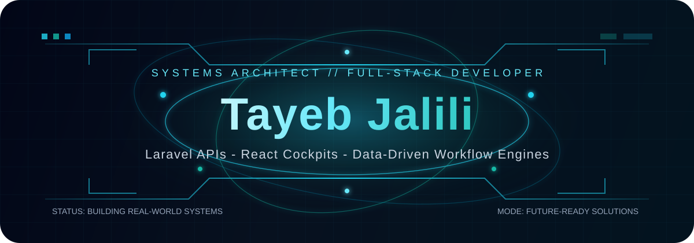
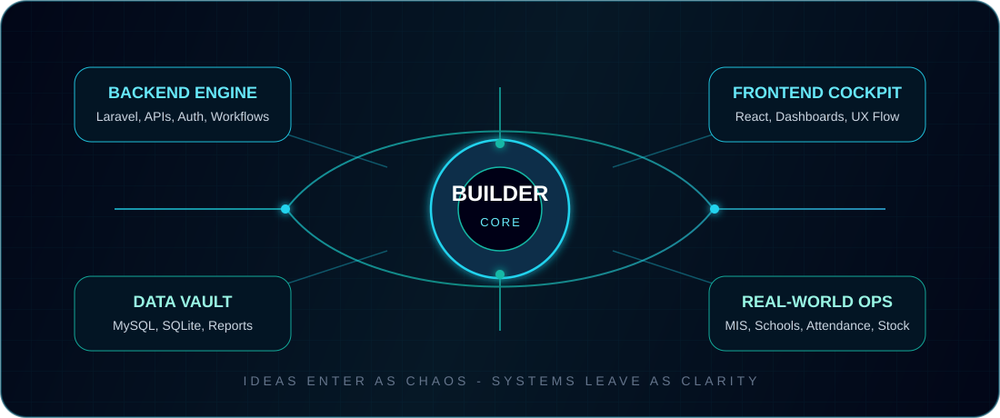

<div align="center">



<br />


<br />
<br />

<a href="https://tayebjalili.netlify.app">
  
</a>
<a href="https://github.com/tayebjalili">
  
</a>
<a href="https://linkedin.com/in/tayeb-jalili-2a3564277">
  
</a>
<a href="mailto:Tayebjalili53@gmail.com">
  
</a>

<br />
<br />


</div>

---


## `// IDENTITY_PACKET`

```php
<?php

final class TayebJalili
{
    public string $role = 'Full-Stack Software Developer';
    public string $mission = 'Transform real-world workflows into reliable software';
    public string $currentArc = 'Software Engineering Student | 2021 - 2025';

    public array $coreStack = [
        'backend' => ['Laravel', 'PHP', 'Node.js', 'Express'],
        'frontend' => ['React', 'Next.js', 'JavaScript'],
        'database' => ['MySQL', 'SQLite'],
        'mobile' => ['Flutter', 'Dart'],
        'tools' => ['Git', 'GitHub', 'Postman']
    ];

    public function build(): string
    {
        return 'Clean APIs + practical UI + data that makes decisions easier';
    }
}
```

I am not here to only make pages look nice. I build **digital operating systems** for schools, offices, teams, and institutions: systems that organize people, data, approvals, attendance, inventory, reports, and daily decisions.

---

## `// COMMAND_CENTER`



---

## `// WHAT_MAKES_MY_WORK_DIFFERENT`

<table>
<tr>
<td width="25%" align="center">
<h3>01</h3>
<strong>Workflow First</strong>
<br />
<br />
I study the real process before designing the database, API, or dashboard.
</td>
<td width="25%" align="center">
<h3>02</h3>
<strong>Backend Depth</strong>
<br />
<br />
Laravel, APIs, authentication, roles, approvals, and reporting are where I go deep.
</td>
<td width="25%" align="center">
<h3>03</h3>
<strong>Useful Interfaces</strong>
<br />
<br />
React screens should guide users, reduce mistakes, and make work faster.
</td>
<td width="25%" align="center">
<h3>04</h3>
<strong>Real Impact</strong>
<br />
<br />
My projects are built around actual education, government, and business needs.
</td>
</tr>
</table>

---

## `// PROJECT_MODULES`

<table>
<tr>
<td width="50%">
<h3>MIS.OS</h3>
<p><strong>Directorate of Student Services Coordination</strong></p>
<p>


</p>
<p>A government-level workflow system designed to organize modules, records, approvals, and institutional operations.</p>
<ul>
<li>Workflow automation</li>
<li>Secure multi-module structure</li>
<li>Operational reporting foundation</li>
</ul>
</td>
<td width="50%">
<h3>ACADEMY.CORE</h3>
<p><strong>School Management System</strong></p>
<p>


</p>
<p>A complete academic control center for students, teachers, classes, and school operations.</p>
<ul>
<li>Student and teacher management</li>
<li>Class organization</li>
<li>Centralized academic workflows</li>
</ul>
</td>
</tr>
<tr>
<td width="50%">
<h3>ATTENDANCE.SIGNAL</h3>
<p><strong>Real-time Attendance System</strong></p>
<p>


</p>
<p>A tracking system focused on speed, clean data, and simple attendance visibility.</p>
<ul>
<li>API-based structure</li>
<li>Fast attendance workflows</li>
<li>Reporting-ready records</li>
</ul>
</td>
<td width="50%">
<h3>INVENTORY.RADAR</h3>
<p><strong>Stock and Sales Tracking</strong></p>
<p>


</p>
<p>A practical inventory system for stock movement, sales visibility, and business reports.</p>
<ul>
<li>Stock management</li>
<li>Sales tracking</li>
<li>Operational dashboards</li>
</ul>
</td>
</tr>
</table>

---

## `// TECH_COCKPIT`

<div align="center">

<h3>Languages</h3>


<h3>Frameworks</h3>


<h3>Data + Tools</h3>


</div>

---

## `// EXPERIENCE_LOG`

<table>
<tr>
<td width="33%" valign="top">
<h3>Kabul University</h3>
<p><strong>Software Developer Intern</strong></p>
<p><code>06/2024 - 12/2024</code></p>
<ul>
<li>Backend development</li>
<li>Database management</li>
<li>System support</li>
</ul>
</td>
<td width="33%" valign="top">
<h3>Ministry of Higher Education</h3>
<p><strong>IT Center Developer</strong></p>
<p><code>2025</code></p>
<ul>
<li>MIS system development</li>
<li>Government workflow optimization</li>
<li>Institutional software support</li>
</ul>
</td>
<td width="33%" valign="top">
<h3>Freelance Developer</h3>
<p><strong>Full-Stack Applications</strong></p>
<p><code>2022 - Present</code></p>
<ul>
<li>Client-focused web apps</li>
<li>Business systems</li>
<li>Practical digital solutions</li>
</ul>
</td>
</tr>
</table>

---

## `// LANGUAGE_INTERFACE`

<table align="center">
<tr>
<td align="center" width="25%">
<strong>English</strong>
<br />
Advanced
</td>
<td align="center" width="25%">
<strong>Pashto</strong>
<br />
Native
</td>
<td align="center" width="25%">
<strong>Dari</strong>
<br />
Proficient
</td>
<td align="center" width="25%">
<strong>Urdu</strong>
<br />
Advanced
</td>
</tr>
</table>

---

## `// LIVE_TELEMETRY`

<div align="center">


<br />
<br />


<br />
<br />


</div>

---

## `// TRANSMISSION`

<div align="center">

<table>
<tr>
<td align="center">
<h3>Ideas enter as chaos. Systems leave as clarity.</h3>
<p>I believe software becomes powerful when it understands the real human problem behind the screen.</p>
<p>
<a href="https://tayebjalili.netlify.app">
  
</a>
<a href="mailto:Tayebjalili53@gmail.com">
  
</a>
</p>
</td>
</tr>
</table>


</div>
