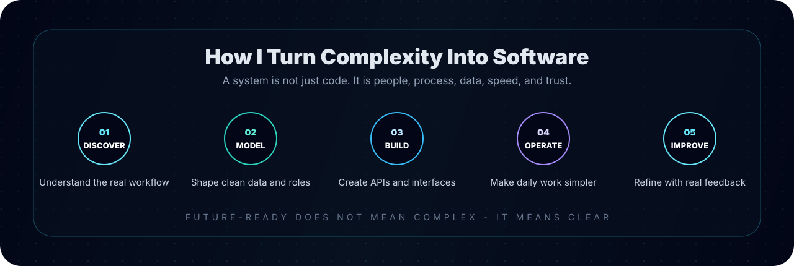

 
 

 
 

---

##  Different by Design

Most profiles show tools. Mine starts with the **problem space**.

I build software for environments where real people need clarity: student services, school operations, attendance workflows, inventory tracking, approvals, dashboards, and institutional data. My focus is not only writing code. It is turning scattered manual work into a system that feels organized, fast, and useful.

<table>
<tr>
<td width="33%" align="center">
<h3>Human Workflow</h3>

Forms, roles, approvals, reports, and decisions come before the code.

</td>
<td width="33%" align="center">
<h3>System Architecture</h3>

Laravel APIs, relational databases, authentication, and maintainable modules.

</td>
<td width="33%" align="center">
<h3>Modern Interface</h3>

React dashboards that make complex operations feel simple.

</td>
</tr>
</table>

---

##  My Build Flow

---

##  Systems I Build

<table>
<tr>
<td width="50%" valign="top">
<h2>MIS Platform</h2>

<strong>For government and student service workflows</strong>

A structured system for records, modules, workflow automation, and institutional reporting.

</td>
<td width="50%" valign="top">
<h2>School OS</h2>

<strong>For academic management and daily operations</strong>

A centralized platform for students, teachers, classes, and academic workflows.

</td>
</tr>
<tr>
<td width="50%" valign="top">
<h2>Attendance Engine</h2>

<strong>For fast tracking and clean records</strong>

An API-based attendance workflow focused on speed, visibility, and reporting-ready data.

</td>
<td width="50%" valign="top">
<h2>Inventory Radar</h2>

<strong>For stock, sales, and operational insight</strong>

A practical business system for tracking stock movement, sales activity, and reports.

</td>
</tr>
</table>

---

##  Technology Constellation

 
 

<table>
<tr>
<td align="center"><strong>Backend</strong> Laravel, PHP, Node.js, Express</td>
<td align="center"><strong>Frontend</strong> React, Next.js, JavaScript</td>
<td align="center"><strong>Data</strong> MySQL, SQLite, reporting logic</td>
<td align="center"><strong>Mobile</strong> Flutter, Dart</td>
</tr>
</table>

---

##  Real-World Timeline

<table>
<tr>
<td width="33%" valign="top">
<h3>Kabul University</h3>

<strong>Software Developer Intern</strong>

<code>06/2024 - 12/2024</code>

Backend development, database management, and system support.

</td>
<td width="33%" valign="top">
<h3>Ministry of Higher Education</h3>

<strong>IT Center Developer</strong>

<code>2025</code>

MIS development, workflow optimization, and government-level system work.

</td>
<td width="33%" valign="top">
<h3>Freelance Developer</h3>

<strong>Full-Stack Applications</strong>

<code>2022 - Present</code>

Client-focused applications, business systems, and practical digital solutions.

</td>
</tr>
</table>

---

##  Live Telemetry

 
 

---

##  Language Interface

<table align="center">
<tr>
<td align="center" width="25%"><strong>English</strong> Advanced</td>
<td align="center" width="25%"><strong>Pashto</strong> Native</td>
<td align="center" width="25%"><strong>Dari</strong> Proficient</td>
<td align="center" width="25%"><strong>Urdu</strong> Advanced</td>
</tr>
</table>

---

<h3>Final Signal</h3>

<em>Software is futuristic when it makes real life simpler.</em>

 

 
 

